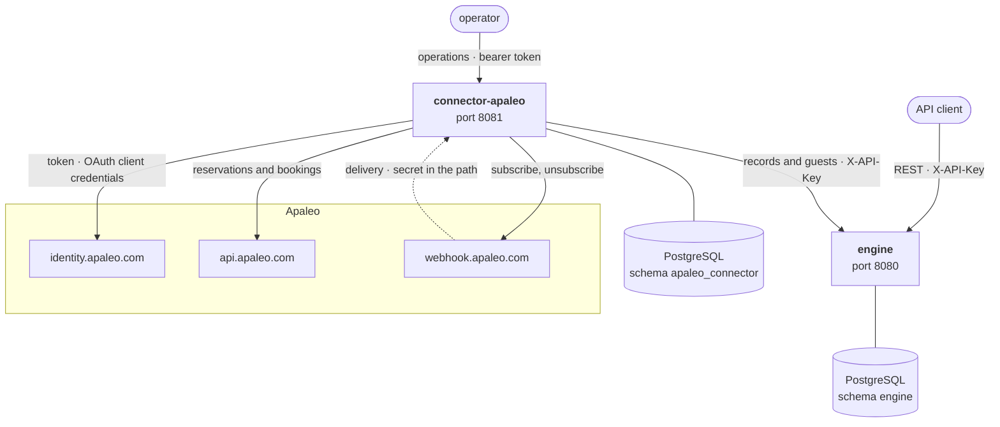

# GuestGraph

**The open-source guest identity graph for hospitality.** → [**guestgraph.io**](https://guestgraph.io)

Guest data lives scattered across the PMS, POS, booking engine, loyalty program, wifi portal, and review platforms — each with its own keys and its own version of the truth. GuestGraph resolves those scattered records into one unified, explainable golden profile per guest: the guest graph.

## 🧭 Where to start

| Repository | What it is |
|---|---|
| [**engine**](https://github.com/guestgraph/engine) | The core: identity resolution engine, guest graph, REST API |
| [**connector-apaleo**](https://github.com/guestgraph/connector-apaleo) | The first connector: reservations and bookings from Apaleo into the guest graph, a client of the engine's API |
| [**guestgraph.github.io**](https://github.com/guestgraph/guestgraph.github.io) | The site at [guestgraph.io](https://guestgraph.io) — landing page, billing, privacy, and the [talks](https://guestgraph.io/talks/) |

**New here?** The [10-minute introduction](https://guestgraph.io/talks/intro/) is the
fastest way in: why a returning guest looks like five strangers, what it costs to merge them
wrongly, and how every decision stays explainable and reversible. DE · EN.

## 🧩 What runs

Two services, two schemas, one direction. A connector calls the engine and never the other way
round, so a deployment can run the engine alone, or run several connectors against one engine.

The engine holds the guest graph and serves the API every other component is a client of; it
calls nothing outward. A connector reaches one external system and submits what it finds. Each
service owns its schema and connects as a role that sees nothing else, so one database or two
is a deployment choice. What each path is and what guards it, in the
[engine](https://github.com/guestgraph/engine#readme) and the
[connector](https://github.com/guestgraph/connector-apaleo#readme) READMEs.

## 🧱 Principles

- **Source records are immutable** — the golden profile is derived and can always be recomputed; corrections arrive as new records, never as edits
- **Every merge is explainable and reversible** — identity resolution you can audit and trust
- **Tenant-scoped from day one** — one instance serves many brands, properties, or customers
- **API-first** — everything the engine can do is reachable over the REST API
- **Apache 2.0** — the core is and will remain open source

Matching is layered by confidence: shared strong identifiers merge outright, probabilistic
scoring only merges above a threshold each tenant chooses, and everything else queues for a
human whose decisions stick. Automatic fuzzy merging ships **off** —
[how matching decides →](https://github.com/guestgraph/engine/blob/main/docs/matching.md)

## 🗺️ Where we are

1. ✅ **Core** — identity resolution engine (deterministic, probabilistic-ready), guest graph, REST API
2. ✅ **Probabilistic matching** — fuzzy/ML resolution behind the same strategy interface, with review queue
3. ✅ **Timeline** — per-guest business-object associations, attributed decisions
4. ✅ **Retired guest ids** — a stored guest id resolves to the current guest after merges and splits
5. ✅ **Connectors** — ingest from real PMS/POS/booking systems; the first, for Apaleo, lives in [connector-apaleo](https://github.com/guestgraph/connector-apaleo) and brings reservations and bookings into the graph

Connectors for more PMS, POS, and booking systems are next. What a phase decided, and the
requirements waiting for a later one, are in the engine's
[roadmap notes](https://github.com/guestgraph/engine/blob/main/docs/roadmap-notes.md), which
feed each slice's specification.

[guestgraph.io](https://guestgraph.io) is the home page. Managed hosting, API, and MCP services
are planned there; the core stays open source either way.

---

*Built spec-first in the open. Early days — star the [core repo](https://github.com/guestgraph/engine) to follow along.*
